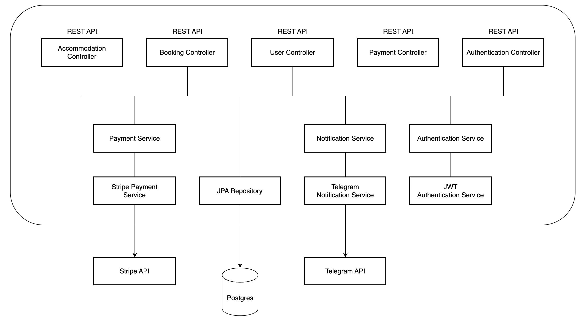

<!-- LOGO -->
<br />
<h1>
<p align="center">
  
  <br>Accommodation Booking Service
</h1>

<p align="center">
  <a href="#about-the-project">About The Project</a> •
  <a href="#technologies-and-tools-used">Technologies</a> •
  <a href="#main-features">Main Features</a> •
  <a href="#architecture">Architecture</a> •
  <a href="#setup-and-usage">Setup</a> •
  <a href="#docker-setup">Docker</a> •
  <a href="#challenges-faced-and-solutions">Challenges</a> •
  <a href="#tests">Tests</a> •
  <a href="#postman-collection">Postman</a> •
  <a href="#video-demonstration">Demonstration</a> •
  <a href="#author">Author</a>
</p>

## About The Project

In this project, we created a booking service for renting apartments or houses in any region. Bookings are available for the period selected by users. Payment for bookings can be conveniently made through the Stripe service using a credit card.
Our mission was to develop an advanced online rental management system for housing. This system will not only simplify the tasks of service administration but also provide tenants with a seamless and efficient platform for securing housing, changing the way housing is rented.

## Technologies and Tools Used

- **Spring Boot v3.3.4**: To create a stand-alone, production-grade Spring-based application.
- **Spring Security v3.3.4**: To handle authentication and authorization.
- **Spring Data JPA v3.3.4**: For database operations.
- **Swagger v2.1.0**: For API documentation.
- **Liquibase v4.27.0**: For database schema changes.
- **Docker v1.18.0**: To containerize the application.
- **Stripe API v28.1.0**: For handling payments.
- **Telegram API v6.7.0**: For sending notifications.

## Main Features 

- **Authentication**: Register and log in to the system. 
- **User Management**: Update user roles and profile information. 
- **Accommodation Management**: Add, update, retrieve, and delete accommodations. 
- **Booking Management**: Create, update, retrieve, and cancel bookings. 
- **Payment Processing**: Handle payment sessions and responses using Stripe. 
- **Notification System**: Send notifications about new bookings, cancellations, and payments using Telegram.

## Architecture



## Setup and Usage

1. **Clone this repository:**
    ```sh
    git clone https://github.com/4Vitalii5/booking-service.git
    ```
2. **Set up Environment Variables**

    - Use a `.env.template` file and add the values for these variables:
    ```plaintext
    DB_URL=your_database_url
    DB_USERNAME=your_database_username
    DB_PASSWORD=your_database_password
    STRIPE_SECRET_KEY=your_stripe_secret_key
    TELEGRAM_BOT_TOKEN=your_telegram_bot_token
    ```

### Docker Setup

1. Create a Docker image:
    ```sh
    docker build -t booking-service .
    ```
2. Run the Docker container:
    ```sh
    docker-compose up
    ```

3. **Access the Application**

    - The application will be running at `http://localhost:8081/api`.

## Challenges Faced and Solutions

1. **Real-Time Property Availability**:

   - **Challenge:** Ensuring accurate real-time property availability was difficult due to inefficient database queries.
   - **Solution:** An effective database schema was developed and implemented and queries were optimized, which allowed
     us to quickly obtain up-to-date information about real estate availability in real time.

2. **Payment Processing**:

   - **Challenge:** Integrating a secure and efficient payment processing system was challenging due to the complexity of
     working with external payment APIs.
   - **Solution:** Stripe API was integrated to process payment transactions, ensuring reliable and secure transactions.
     This allowed users to conveniently make payments using credit cards.

3. **Notification System**:
   - **Challenge:** There was a need to promptly notify administrators about important events, such as new bookings or
     cancellations.
   - **Solution:** A notification system was set up using the Telegram API, which allowed for quick and efficient
     communication so that administrators were kept up to date with all bookings and payments.

## Tests

### Test Results and Coverage

| Metric        | Value |
|---------------|-------|
| Total Tests   | 104   |
| Passed Tests  | 104   |
| Failed Tests  | 0     |
| Skipped Tests | 0     |

### Coverage Summary

| Coverage Type | Percentage |
|---------------|------------|
| Lines         | 95%        |
| Branches      | 75%        |
| Method        | 96%        |
| Class         | 100%       |

## Postman Collection

For easy testing and interaction with the API, you can use the Postman collection containing all necessary requests.

### 🚀Usage

1. Open Postman and import the [Bokking_App.postman_collection.json](src/main/resources/postman/Booking_App.postman_collection.json).
2. Navigate to the imported Accommodation Booking Service collection.
3. Execute the necessary requests using the appropriate methods and parameters.

> **Note:** Before using the requests, ensure that your local server is running, and you have access to the database.

## Video Demonstration

- Watch a [Loom Video](https://www.loom.com/share/3f1840b2718641c2874d44f6e77dc983?sid=6fb2c9d2-f3a2-4e90-9930-e3bf8da12e19) to see how the project works.

## Author

👤 **Vitalii Pavlyk**

- Linkedin: [@VitaliiPavlyk](https://www.linkedin.com/in/vitalii-pavlyk-82b5aa1a1/)
- Github: [@4Vitalii5](https://github.com/4Vitalii5)

## 📝 License

Copyright © 2025 [Vitalii Pavlyk](https://github.com/4Vitalii5).<br />
This project is [MIT](https://github.com/4Vitalii5/booking-app/blob/631f606cff931baeebb3458c3022d033bc5466ac/LICENSE) licensed.

## Happy Coding!

---
